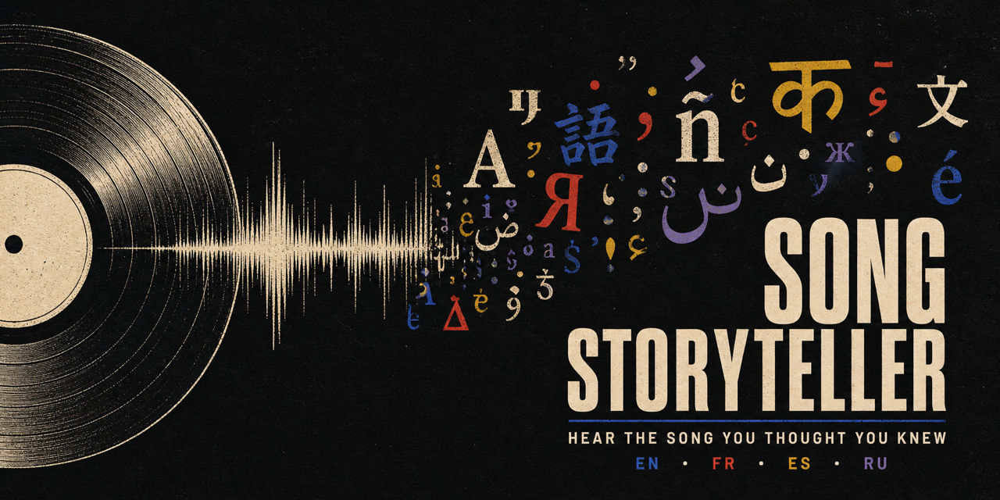

# Song Storyteller



**Écoutez autrement la chanson que vous pensiez connaître.**

Song Storyteller est un Agent Skill open source qui explique d'abord ce qu'une chanson raconte vraiment, puis en retrace l'histoire vérifiée afin de transformer la prochaine écoute.

Il est conçu pour les chansons dans toutes les langues et répond dans celle du lecteur. Donnez-lui un titre et un interprète, un lien, un remix, une reprise, un chant traditionnel ou une œuvre instrumentale. Pour les langues rares, la qualité dépend du modèle sous-jacent et des sources fiables disponibles ; l'agent signale ces limites au lieu d'inventer.

> `Utilise $song-storyteller : Кино — Пачка сигарет`

[English](README.md) · [Français](README.fr.md) · [Español](README.es.md) · [Русский](README.ru.md)

## Langues de lancement

L'anglais, le français, l'espagnol et le russe sont les quatre langues principales de la première version pour la documentation et les démonstrations. Le skill lui-même reste indépendant de la langue.

## Ce qui le distingue

- **Le sens d'abord.** Le premier paragraphe indique qui parle, à qui et dans quelle situation.
- **Une recherche dans la culture d'origine.** L'agent consulte des sources dans la langue de la chanson, celle du lecteur et une langue intermédiaire utile.
- **Les preuves avant l'effet.** Interviews, archives, livrets et presse musicale fiable passent avant les légendes répétées en ligne.
- **Une traduction au-delà des mots.** Idiomes, dialectes, jeux de mots, registres et références culturelles sont expliqués par de courtes paraphrases.
- **Une véritable voix éditoriale.** Le skill coupe le jargon, le faux suspense, les conclusions répétées et les anecdotes inutiles.
- **Le respect du droit d'auteur.** Il peut analyser une courte formule, mais ne reproduit ni ne traduit intégralement les paroles.

## Installation

```bash
npx skills add kosbushe/song-storyteller -g --skill song-storyteller -y
```

Installation interactive avec choix de l'agent :

```bash
npx skills add kosbushe/song-storyteller
```

## Utilisation

```text
Utilise $song-storyteller : Stromae — Papaoutai
```

```text
Utilise $song-storyteller pour raconter Madonna — Secret en russe.
```

Vous pouvez demander une chronique brève ou approfondie, choisir la langue de sortie et insister sur le texte, la production, l'histoire ou une légende contestée.

## Histoires de démonstration

- [Madonna — *Secret*, racontée en russe](examples/ru/madonna-secret.md)
- [Кино — *Пачка сигарет*, racontée en français](examples/fr/kino-pachka-sigaret.md)
- [Stromae — *Papaoutai*, racontée en espagnol](examples/es/stromae-papaoutai.md)

## Promesse éditoriale

Chaque article doit expliquer le sens dès les deux premiers paragraphes, distinguer les déclarations de l'auteur de l'analyse et de la réception publique, citer les faits essentiels et finir par deux détails concrets à écouter. Si les sources manquent, l'agent le dit. Il n'invente jamais une révélation spectaculaire.

## Licence

[MIT](LICENSE). Song Storyteller est un projet open source indépendant, sans affiliation avec un artiste, un label, une plateforme de streaming ou un média musical.
